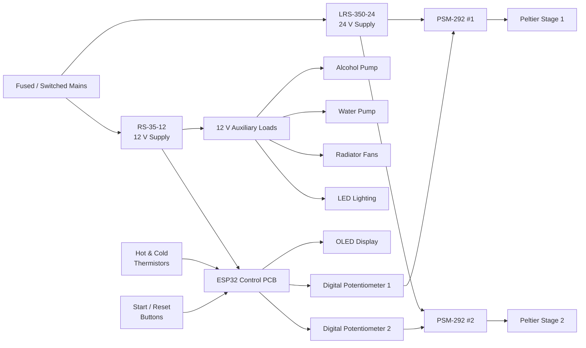

# CNES Cloud Chamber Control PCB — ESP32-Based PCB Design

An ongoing **ESP32-based control PCB** developed for the **Concordia Nuclear Engineering Society (CNES) portable diffusion cloud chamber**.

I am serving as the **PCB Design Team Lead** for the project, leading the development of the low-voltage control PCB in **KiCad** and helping translate the overall cloud chamber electronics requirements into a manufacturable board design.

> **Project Status:** In Progress — schematic refinement is nearing completion. Footprint assignment, PCB layout/routing, manufacturing files, and hardware validation are still in development.

---

## Project Overview

A diffusion cloud chamber makes ionizing particle tracks visible by creating a supersaturated alcohol-vapor region above a cooled plate.

The complete CNES system requires several electrical subsystems working together, including:

- Peltier-based cooling
- hot-side and cold-side temperature sensing
- alcohol circulation
- radiator cooling
- chamber illumination
- user controls and display
- electronic regulation of the Peltier cooling stages

The purpose of this project is to develop a **central low-voltage control PCB** that connects these subsystems to an ESP32 and provides the sensing, control, and interface circuitry required by the chamber.

The high-current **24 V Peltier power path remains external to this PCB**. The PCB primarily handles control signals, sensing, user interfaces, and auxiliary 12 V loads.

---

## System Architecture

The cloud chamber uses two main power branches:

- **12 V auxiliary/control branch** — powers the PCB, pumps, fans, LED lighting, and ESP32 power conversion.
- **24 V Peltier branch** — powers two external PSM-292 adjustable buck converters that regulate the two Peltier cooling stages.


*High-level CNES cloud chamber system architecture.*

### Simplified Electrical Architecture



---

## Control Unit Architecture

The ESP32 acts as the central controller for the PCB.

It receives temperature measurements from external thermistors and user inputs from PCB-mounted pushbuttons while controlling or interfacing with the chamber's auxiliary electrical systems.


*Control-unit concept showing sensing, microcontroller control, digital potentiometers, and switched loads.*

---

## PCB Design

The current design uses a **38-pin ESP32 DevKit mounted on two 1×19 headers**, allowing the custom PCB to operate as a carrier/control board.

Using a complete ESP32 DevKit provides built-in:

- USB programming
- voltage regulation
- reset/boot circuitry
- development and debugging support

This reduces implementation risk compared with designing directly around a bare ESP32 device for this prototype.

### Current KiCad Schematic


*Current development-stage KiCad schematic for the control PCB.*

---

## Main PCB Subsystems

| Subsystem | Function |
|---|---|
| **ESP32 DevKit Interface** | Central processing and system control |
| **12 V Power Input** | Receives auxiliary power from the RS-35-12 supply |
| **12 V → 5 V Conversion** | Powers the ESP32 DevKit |
| **Thermistor Interfaces** | Measures hot-side and cold-side temperatures |
| **Alcohol Pump Switch** | ESP32-controlled MOSFET switching of the 12 V alcohol pump |
| **LED Strip Switch** | ESP32-controlled MOSFET switching of chamber illumination |
| **Water Pump Output** | Continuous 12 V output for coolant circulation |
| **Radiator Fan Outputs** | Continuous 12 V outputs for radiator cooling fans |
| **OLED Interface** | PCB-mounted I²C display |
| **Pushbuttons** | PCB-mounted Start and Reset controls |
| **PSM-292 Interfaces** | Connections for electronic Peltier-power adjustment |
| **Digital Potentiometer Control** | Planned SPI-based control of the two PSM-292 converters |

---

## Temperature Sensing

Two external **NTC thermistors** are intended to measure:

- cold-side / chamber plate temperature
- hot-side / cooling-system temperature

The physical thermistors are installed at the locations being measured rather than directly on the PCB.

Each thermistor forms a voltage divider with a **10 kΩ fixed resistor** on the control PCB.

```text
+3.3 V
   |
   |
External NTC Thermistor
   |
   +------> ESP32 ADC
   |
 10 kΩ
   |
  GND
```

The ESP32 reads the divider voltage through its ADC and firmware can convert:

```text
ADC Voltage → Thermistor Resistance → Temperature
```

The final thermistor model and temperature-conversion parameters still require confirmation.

---

## Alcohol Pump Control

The 12 V alcohol pump is controlled using a **low-side N-channel MOSFET switch**.

```text
+12 V
  |
Alcohol Pump
  |
  +---- Flyback Diode ----+
  |                       |
MOSFET                     |
  |                       |
 GND ---------------------+
```

The circuit includes:

- logic-level N-channel MOSFET
- 220 Ω gate resistor
- 100 kΩ gate pulldown resistor
- flyback diode for motor inductive transients

The pump is approximately **12 V / 5 W**, corresponding to a nominal current of about:

```text
I = P / V
I = 5 W / 12 V
I ≈ 0.42 A
```

The final MOSFET and flyback-diode part numbers are still being selected.

---

## LED Lighting Control

The chamber lighting is also switched using a low-side N-channel MOSFET controlled by the ESP32.

The LED switching circuit uses:

- logic-level N-channel MOSFET
- 220 Ω gate resistor
- 100 kΩ pulldown resistor

Unlike the alcohol pump, the LED strip does not require a motor flyback diode.

The exact LED strip and its final current requirement are still TBD.

---

## Water Pump & Radiator Cooling

The current design provides continuous 12 V power to:

- the water/coolant circulation pump
- radiator cooling fans

The water pump is currently estimated at approximately **20 W**:

```text
I = 20 W / 12 V
I ≈ 1.67 A
```

Because this is a relatively high-current load for the board, connector type and PCB trace width must be selected accordingly.

The current schematic supports **four 12 V radiator fan outputs**.

---

## OLED & User Controls

The board is designed to support a PCB-mounted:

- **1.3-inch 128×64 I²C OLED**
- **Start button**
- **Reset button**

The buttons are normally-open momentary switches connected between the ESP32 GPIO inputs and ground.

Firmware will use internal pull-ups, giving an active-low interface:

```text
Button Released → HIGH
Button Pressed  → LOW
```

The exact OLED module and mechanical footprint still need to be finalized before PCB layout.

---

## Peltier Power Control

The chamber uses two external **PSM-292 adjustable buck converter modules** to regulate the two Peltier cooling stages.

The planned control architecture is:

```text
ESP32
  |
 SPI
  |
  v
Digital Potentiometer
  |
 A / W / B
  |
  v
PSM-292
  |
  v
Peltier Stage
```

Two digital potentiometer channels are required because the system contains two independently adjustable PSM-292 converters.

The SPI clock and MOSI signals can be shared, while each digital potentiometer uses its own chip-select line.

### Important Design Item

The digital-potentiometer interface is still under development.

Before finalizing this part of the PCB, the following must be verified experimentally:

- original PSM-292 potentiometer resistance
- A/W/B terminal voltages
- terminal current
- compatibility with a digital potentiometer
- safe digital-potentiometer voltage range
- final digital-potentiometer IC
- whether additional protection or interface circuitry is required

The PSM-292 control concept should therefore be considered **planned and under validation**, not finalized.

---

## My Role — PCB Design Team Lead

My responsibility in the CNES cloud chamber project is primarily the development and coordination of the control PCB.

### Contributions to Date

- Leading the PCB design effort for the cloud chamber electronics
- Translating system-level block diagrams and requirements into a KiCad schematic
- Selecting an ESP32 DevKit carrier-board architecture
- Developing the 38-pin ESP32 header and GPIO assignment scheme
- Designing hot-side and cold-side thermistor ADC interfaces
- Designing the alcohol-pump MOSFET switching circuit
- Adding flyback-diode protection for the alcohol pump
- Designing the LED-strip MOSFET switching circuit
- Adding gate resistors and pulldown resistors for controlled MOSFET operation
- Developing 12 V fan and water-pump output interfaces
- Integrating PCB-mounted OLED and pushbutton interfaces
- Developing interfaces for the two external PSM-292 converters
- Planning SPI-controlled digital-potentiometer integration
- Performing KiCad Electrical Rules Checks (ERC)
- Resolving schematic connectivity and power-net warnings
- Coordinating design decisions with the project lead
- Supporting other student team members learning PCB design concepts

The schematic has reached a reported **0 active ERC violations**, although ERC correctness does not replace component compatibility or hardware testing.

---

## Design Development Workflow

The PCB is being developed through the following engineering process:

```mermaid
flowchart LR
    A["System Requirements"] --> B["System Block Diagram"]
    B --> C["Control Architecture"]
    C --> D["KiCad Schematic"]
    D --> E["Component Verification"]
    E --> F["Footprint Assignment"]
    F --> G["PCB Placement"]
    G --> H["Routing"]
    H --> I["DRC + 3D Review"]
    I --> J["Gerber / Manufacturing Files"]
    J --> K["PCB Assembly"]
    K --> L["Hardware Validation"]
```



### Current Position

```text
Requirements
    ↓
Block Diagrams
    ↓
Schematic Design
    ↓
Schematic Refinement      ← CURRENT STAGE
    ↓
Component Selection
    ↓
Footprint Assignment
    ↓
PCB Layout / Routing
    ↓
DRC / 3D Review
    ↓
Gerber Generation
    ↓
Manufacturing
    ↓
Hardware Testing
```

---

## Current Project Status

### Completed / Mostly Completed

- [x] System architecture
- [x] ESP32 DevKit control architecture
- [x] ESP32 GPIO assignments
- [x] thermistor interface circuits
- [x] alcohol pump MOSFET circuit
- [x] LED MOSFET circuit
- [x] water-pump power output
- [x] radiator fan outputs
- [x] OLED interface
- [x] Start / Reset button interface
- [x] PSM-292 A/W/B interface connectors
- [x] schematic ERC cleanup
- [x] 0 active ERC violations at current schematic stage

### In Progress / Remaining

- [ ] finalize digital potentiometer / PSM-292 compatibility
- [ ] select exact digital potentiometer ICs
- [ ] confirm exact ESP32 DevKit mechanical footprint
- [ ] select exact OLED module
- [ ] select final MOSFETs
- [ ] select final flyback diode
- [ ] confirm LED strip specifications
- [ ] confirm radiator fan specifications
- [ ] finalize 12 V → 5 V buck implementation
- [ ] verify complete 12 V system power budget
- [ ] assign PCB footprints
- [ ] perform PCB placement
- [ ] route PCB
- [ ] perform DRC
- [ ] perform 3D mechanical review
- [ ] generate Gerber and drill files
- [ ] prepare BOM / manufacturing files
- [ ] assemble prototype
- [ ] perform hardware validation

---

## PCB Layout Considerations

The upcoming layout stage will include consideration of:

- wider traces for auxiliary 12 V loads
- high-current water-pump routing
- short MOSFET current paths
- flyback diode placement near the pump switching loop
- gate resistors placed close to MOSFET gates
- separation of thermistor analog signals from noisy switching paths
- appropriate connector placement
- ESP32 USB accessibility
- OLED visibility through the enclosure
- pushbutton accessibility
- mechanical mounting holes
- wiring access for pumps, fans, thermistors, and PSM-292 modules
- ground-plane strategy
- enclosure and side-panel clearance

The high-current 24 V Peltier power will **not** be routed through this PCB.

---

## Repository Structure

```text
CNES-Cloud-Chamber-Control-PCB/
│
├── docs/
│   └── Project documentation and design reports
│
├── hardware/
│   └── KiCad schematic and PCB design files
│
├── manufacturing/
│   └── Gerbers, drill files, BOM and fabrication outputs
│
├── firmware/
│   └── ESP32 firmware and control software
│
├── media/
│   ├── KiCad Schematic.png
│   ├── System Block Diagram.png
│   └── Control Unit Block Diagram.png
│
├── README.md
└── .gitignore
```

---

## Tools & Technologies

- **KiCad**
- **ESP32**
- **PCB Design**
- **Schematic Design**
- **Embedded Systems**
- **Power Electronics**
- **Analog Sensor Interfacing**
- **MOSFET Switching**
- **I²C**
- **SPI**
- **Thermistors / ADC Measurement**
- **Git / GitHub**

---

## Planned Hardware Validation

Before a final manufacturing release, critical subsystems will need to be tested and documented.

Planned validation includes:

1. verifying the 12 V and 5 V power paths
2. confirming ESP32 operation
3. checking thermistor ADC measurements
4. testing active-low Start and Reset buttons
5. verifying OLED communication
6. testing alcohol pump switching
7. testing LED switching
8. measuring actual auxiliary-load currents
9. measuring PSM-292 potentiometer terminal characteristics
10. validating the proposed digital-potentiometer replacement
11. checking temperature performance during chamber operation

Measured results will be added to this repository as the project progresses.

---

## Documentation

Detailed design documentation is maintained in the [`docs/`](docs/) directory.

The documentation records:

- design decisions
- subsystem explanations
- electrical calculations
- unresolved design items
- component-selection requirements
- KiCad ERC results
- PCB-layout considerations
- future hardware-validation results

---

## Project Status Notice

This repository documents an **active engineering project**.

The schematic, component selections, PCB layout, and manufacturing outputs may change as testing and design reviews continue.

The PCB has **not yet been manufactured or fully hardware-validated**.

---

## Organization

Developed as part of the **Concordia Nuclear Engineering Society (CNES)** Cloud Chamber project at **Concordia University**.

**Role:** PCB Design Team Lead  
**Focus:** Control PCB architecture, schematic design, subsystem integration, and PCB development

---

## Future Updates

As the project progresses, this repository will be updated with:

- finalized schematic files
- selected component part numbers
- PCB layout
- routed-board screenshots
- KiCad 3D renders
- Gerber files
- BOM
- manufacturing files
- assembled PCB photographs
- test measurements
- cloud chamber integration results

---

*This repository currently represents the schematic-development stage of the CNES Cloud Chamber Control PCB project.*
